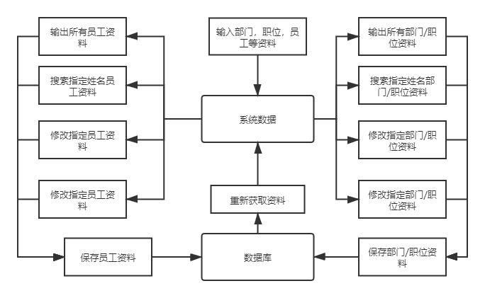
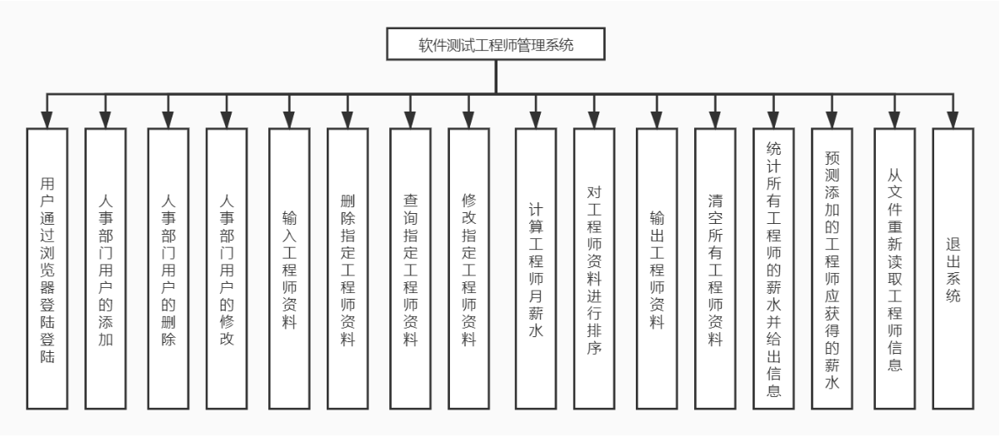

#目录

[TOC]

# 1.引言

(1)采用浏览器/服务器模式，用户通过浏览器访问系统功能。(用户指人事部 ]的用户)

(2)用户必须登录才能访问。用户的添加、删除和修改可由系统管理员完成，用户自己不能注册。

(3)用户的所有修改性操作必须记录于数据库。

(4)数据采用数据库管理。

## 1.1 编写目的

​				本软件需求规格说明的目的在于为《软件测试工程师管理系统》项目的开发提供：

​				a.  提出软件总体要求，作为软件开发人员和最终使用者之间相互了解的基础；

​				b.  提出软件功能要求、性能要求、接口要求、数据结构等要求，作为软件设计和程序编制的基础；

​				c.  为软件测试提供依据。

​				本软件需求规格说明的读者对象主要是项目主管、软件设计人员和最终用户。

## 1.2 项目背景

​				该项目的实施主要是为提高春田花花公司的人事管理效率而编制的

## 1.3 定义

## 1.4 参考资料

​			a.  《软件测试工程师管理项目条款》—春田花花公司。

# 1    项目概述

## 1.1  软件总体说明

​    本项目的目标是完成一个计算机人事管理系统，实现人事管理的自动化。系统的主要功能包括：用户的登陆，添加，修改，通过浏览器访问以及人事信息的录入、管理、查询、删除、生成报表,统计数据，预测薪水等。

​    进入本系统提供用户选择菜单，要求人机界面友好，具有错误处理和故障恢复能力。   

## 1.2  总体数据流图

按照功能设计，系统数据流图如下：

 

​																			图一：系统数据流图

 

## 1.3  使用者的特点

本软件的最终用户是春田花花公司的人事专员和财务专员。具有计算机操作和使用技能。且熟悉业务。

## 1.4  条件和限制

为了使开发者尽快毕业，要求本系统在的开发周期较短，要求在学期结束之前完成，因此要求因此要求系统设计一人，程序员二人，测试工程师一人。

# 2    运行环境

本软件的最终运行环境是操作系统Windows10,Windows7,linux等环境上,要求有中文平台或操作系统为中文的计算机上。

## 2.1  运行软件系统所需的设备能力

一台微机：主频>=100，硬盘>=1M，内存>=1M；

一台打印机；

## 2.2  支持软件环境

操作系统：Windows7以上，或Linux。

开发环境：Eclipse，tomcat9.0

 

## 2.3  故障处理

当系统缺少参数等情况时，给出提示，并返回安全状态；

当系统出现故障无法返回时，用户的数据不能丢失，重新启动系统，可实现数据恢复。

# 3    软件详细要求

## 3.1  性能需求

要求本系统在完成各项功能的同时，要求系统处理迅速，处理事务需要长时间时，提示用户等待且等待时间在用户可接收的范围之内。

## 3.2  功能需求

根据系统功能的需要，对系统的功能进行划分，表示如下图：

 

图二：软件测试工程师管理系统功能

下面详述每一项功能的要求：

### 3.2.1 用户模块
#### 3.2.1.1 用户通过浏览器登录
人事部门用户可通过浏览器输入账号密码的方式登录系统，对公司的员工，部门，职位等信息进行管理

#### 3.2.1.2 用户的添加
用户的资料主要包括登录名，用户名和密码，他们都是字符串

#### 3.2.1.3 用户的删除
可根据两种方式查询用户信息，一种是通过用户的姓名查询指定用户的信息，第二种是从所有用户中找到指定用户，然后通过按键的方式将其删除
#### 3.2.1.4 用户的修改
可根据两种方式查询用户信息，一种是通过用户的姓名查询指定用户的信息，第二种是从所有员工中找到指定员工，然后通过按键的方式进入信息修改界面

### 3.2.2 部门模块
#### 3.2.2.1 部门的添加
部门的资料主要包括部门名称和详细信息
​ 部门名称：为字符串
​ 详细信息：为字符串
#### 3.2.2.2 部门的删除
可根据两种方式查询部门信息，一种是通过部门的姓名查询指定用户的信息，第二种是从所有部门中找到指定部门，然后通过按键的方式将其删除
#### 3.2.2.3 部门的修改
可根据两种方式查询部门信息，一种是通过部门的姓名查询指定部门的信息，第二种是从所有部门中找到指定部门，然后通过按键的方式进入信息修改界面

### 3.2.3 职位模块
#### 3.2.3.1 部门的添加
部门的资料主要包括部门名称和详细信息
​ 部门名称：为字符串
​ 详细信息：为字符串
#### 3.2.3.2 部门的删除
可根据两种方式查询职位信息，一种是通过用户的姓名查询指定职位的信息，第二种是从所有职位中找到指定职位，然后通过按键的方式将其删除
#### 3.2.3.3 部门的修改
可根据两种方式查询职位信息，一种是通过用户的姓名查询指定职位的信息，第二种是从所有职位中找到指定职位，然后通过按键的方式进入信息修改界面
### 3.2.4 员工模块
#### 3.2.4.1 员工的添加
​       员工的资料主要包括：编号、姓名、性别、工龄、籍贯、学历、地址、电话、职位、薪水、部门。

​       编号：编号为数字，编号使用数字，不能重复。

​       姓名：为字符，最长不超过20个字符。不能为空。

​       性别：用数字表示0表示女，1表示男。不能为其它数值。

​       籍贯：使用字符表示，最长不超过10个字符。不能为空。

​       学历：使用数字表示高中0、学士1、硕士2、博士3、其它为4。不能为其它数字。

​       地址：使用字符表示，最长不超过30个字符。不能为空。

​       电话：使用字符表示，最长不超过15个字符。不能为空。

​       工龄：使用数字表示，工龄范围是(0,50]。

​       基本薪水：为实型，不能为0。

​       对这些输入的信息进行合法性检查。保证系统接收合法的输入。用户输入错误时具有提示功能和重新输入功能。
#### 3.2.4.2 员工的删除
可根据两种方式查询员工信息，一种是通过员工的姓名查询指定职位的信息，第二种是从所有员工中找到指定职位，然后通过按键的方式将其删除
#### 3.2.4.3 员工的修改
可根据两种方式查询员工信息，一种是通过用户的员工查询指定职位的信息，第二种是从所有员工中找到指定职位，然后通过按键的方式进入信息修改界面
### 3.2.5 公告模块
#### 3.2.5.1 公告的添加
公告的资料主要包括公告名称和详细信息
​ 公告名称：为字符串
​ 详细信息：为字符串
#### 3.2.5.2 公告的删除
可根据两种方式查询公告信息，一种是通过公告的名称查询指定职位的信息，第二种是从所有公告中找到指定职位，然后通过按键的方式将其删除
#### 3.2.5.3 公告的修改
可根据两种方式查询公告信息，一种是通过公告的名称查询指定职位的信息，第二种是从所有公告中找到指定职位，然后通过按键的方式进入信息修改界面
### 4.2.6 保存数据库中的资料
### 4.2.6 输出数据库中的资料
### 4.2.7从文件重新得到工程师资料

这项功能主要是为了用户进行某些操作后，没有保存到文件前，可以从文件重新得到这些数据信息，使用户的操作不起作用。

### 4.2.8退出系统

当用户不再使用该系统后，可退出该系统。如果用户进行了影响工程师资料信息的操作，提示用户是否进行保存。

 

 

# 4    数据需求

软件测试工程师资料数据类型和说明。

 

| 成员     | 类型            | 说明                                          |
| -------- | --------------- | --------------------------------------------- |
| 编号     | 整型            | 用四位数字表示。例如：0001                    |
| 姓名     | 字符            | 0<表示长度<=20                                |
| 性别     | 整型（枚举）    | 0表示女、1表示男                              |
| 学历     | 整型（枚举）    | 0高中1学士2硕士3博士4其它                     |
| 籍贯     | 字符            | 0<表示长度<=10                                |
| 地址     | 字符            | 0<表示长度<=30                                |
| 电话     | 字符（数字或-） | 0<表示长度<=15，有分机时在后面使用’-’接分机号 |
| 工龄     | 整型            | 0<工龄<50                                     |
| 基本工资 | 实型            | 0<工资                                        |

​                            表一：工程师数据成员列表

