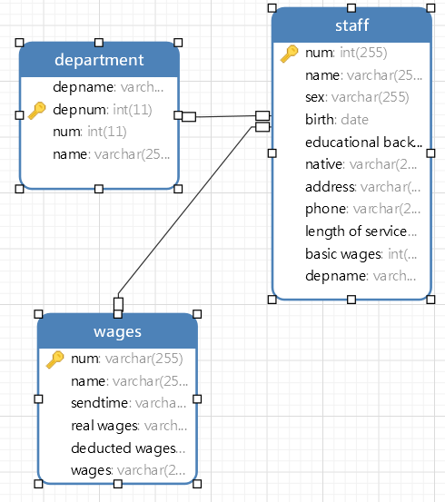

1.描述整个软件结构的图
2.每个模块的功能介绍、提供的接口、使用其他接口的模块
3.数据库的设计
4.实现计划、包括人员任务的分配和时间进度的安排

# 1    数据库设计

### 1.1用户资料说明

用户数据库

| 成员     | 类型            | 说明                       |
| -------- | --------------- | -------------------------- |
| 编号     | 整型            | 用四位数字表示。例如：0001 |
| 姓名     | 字符            | 0<表示长度<=30             |
| 性别     | 字符            | 男,女                      |
| 出生日期 | date类型        | 完整的年月日如2001/0121    |
| 学历     | 字符            | 高中,学士,硕士,博士,其它   |
| 籍贯     | 字符            | 0<表示长度<=30             |
| 地址     | 字符            | 0<表示长度<=30             |
| 电话     | 字符（数字或-） | 0<表示长度<=15             |
| 工龄     | 整型            | 0<工龄<50                  |
| 基本工资 | 实型            | 0<工资                     |

管理员数据库

| 成员       | 类型 | 说明                                                         |
| ---------- | ---- | ------------------------------------------------------------ |
|            |      |                                                              |
| 管理员id   | 整型 | 用四位数字表示。例如：0001                                   |
| 姓名       | 字符 | 0<表示长度<=30                                               |
| 管理员权限 | 字符 | 1:表示可添加用户 2.可拉黑用户 3.可对用户的数据进行管理。可同时有多个权限 |

### 1.2 E-R图

# 2分工详情

邹雨加：数据库的创建、代码实现

黄磊：服务器代码实现

徐婕婕：美化、前端代码实现

杨思梦：总体设计，测试

# 3时间分配

在第9周之前将数据库创建完善。

在第10周之前将服务器功能基本实现。

在第11周之前总体实现。

在第12周之前美观界面，总体测试。

